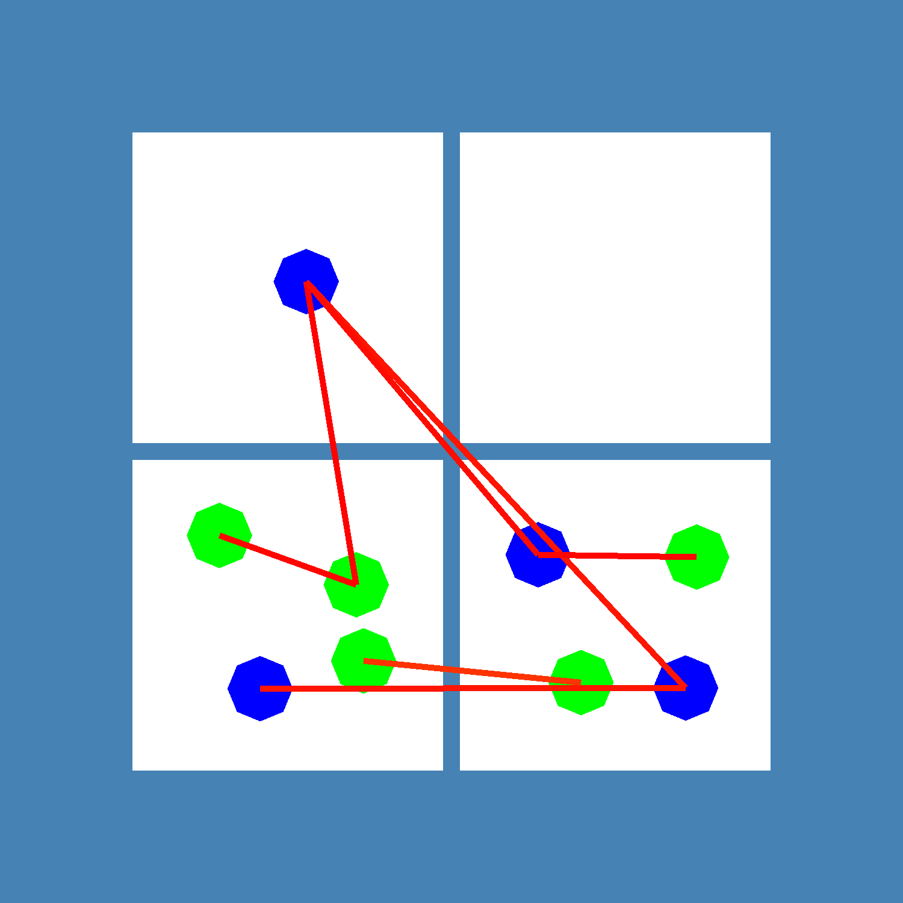

[](https://github.com/DARMA-tasking/vt-tv/actions/workflows/build-and-test.yml)

# tv => task visualizer

`vt-tv` provides visualizations of an application's work-to-rank mappings, communications, and memory usage.

## Overview

Specifically, the task visualizer takes in JSON files that describe work as a series of phases and subphases that contain 1) tasks for each rank, 2) communications, and 3) other user-defined fields (such as memory usage).

Using this input data, the task visualizer produces Exodus meshes to
describe the ranks and objects over time, which can be visualized
using Paraview. Additionally, the task visualizer can produce PNGs
directly using a VTK workflow to render a visualization of ranks and
tasks over phases (as seen below).



## Getting Started

You will need the following dependencies:

1. A C++ compiler that supports C++17
2. [`cmake`](https://cmake.org/cmake/help/latest/) >= 3.17
3. [`VTK`](https://docs.vtk.org/en/latest/index.html) (build instructions [here](https://gitlab.kitware.com/vtk/vtk/-/blob/master/Documentation/docs/build_instructions/build.md))

Begin by cloning `vt-tv`:

```
git clone https://github.com/DARMA-tasking/vt-tv.git
```

_In future directions, we will assume that the `vt-tv` source is located in `${VTTV_SOURCE_DIR}`._

## Installation and Usage

`vt-tv` can installed as either a standalone C++ app or as a Python module. Instructions for both cases are included in the dropdowns below.

<details>
<summary><h3><code>vt-tv</code> Standalone</h3></summary>

### 1. Install

A sample build script is provided in `dev-build.sh` (you will need to update the paths).

For an interactive build (recommended), run from the `vt-tv` directory:

```bash
./build.sh
```

_In future directions, we will assume  that the `vt-tv` build is in `${VTTV_BUILD_DIR}`._

### 2. Usage

`vt-tv` requires two inputs:

1. One or more JSON data files
2. A YAML configuration file (which contains the path to the JSON data files)

The basic call to `vt-tv` is:

```bash
${VTTV_BUILD_DIR}/apps/vt_standalone -c path/to/config
```

**Important**: the `path/to/config` argument should be relative to `${VTTV_SOURCE_DIR}` (see example below).

### YAML Input

A sample YAML configuration file can be found in `${VTTV_SOURCE_DIR}/config/conf.yaml`. To use it, run

```bash
${VTTV_BUILD_DIR}/apps/vt_standalone -c config/conf.yaml
```

### JSON Data Files

Sample JSON data files are provided in `${VTTV_SOURCE_DIR}/tests/unit/lb_test_data`.

Information regarding the JSON format can be found [in vt's
documentation](https://darma-tasking.github.io/docs/html/node-lb-data.html); the JSON schema validator is located [here](https://github.com/DARMA-tasking/vt/blob/develop/scripts/JSON_data_files_validator.py).


</details>
<details>
<summary><h3><code>vt-tv</code> Python Module</h3></summary>

### Dependencies

In addition to the basic `vt-tv` dependencies listed above, you will also need:

1. A Python version between 3.8 - 3.11
2. [`nanobind`](https://nanobind.readthedocs.io/en/latest/), which can be installed with:

```sh
pip install nanobind
```

### 1. Install

First, specify the location of your `VTK` build (see above) with:

```bash
export VTK_DIR=/path/to/vtk/build
```

Optional: To specify the number of parallel jobs to use during the build, you can set the `VT_TV_CMAKE_JOBS` environment variable:

```bash
export VT_TV_CMAKE_JOBS=8
```

Then install the binded `vt-tv` Python module with:

```bash
pip install <path/to/vt-tv/source>
```

_Note: Behind the scenes, the usual `cmake` and `make` commands are run. Depending on your system, this can cause the install process to be lengthy as it will be compiling the entire `vt-tv` library._

### 2. Usage

Import the `vt-tv` module into your project using:

```python
import vttv
```

The only function you need is `vttv.tvFromJson`, which has the following (C++) function signature:

```cpp
void tvFromJson(
    const std::vector<std::string>& input_json_per_rank_list,
    const std::string& input_yaml_params_str,
    uint64_t num_ranks
)
```

The parameters are:
- `input_json_per_rank_list`: A list of the input JSON data strings (one string per rank). In the C++ standalone app, this equates to the input JSON data files.
- `input_yaml_params_str`: The visualization and output configuration data, formatted as a dictionary but exported as a string (see example below). This equates to the standalone app's input YAML configuration file.
- `num_ranks`: The number of ranks to be visualized by `vt-tv`.

As an example, here is the (emptied) code used by the [`Load Balancing Analysis Framework`](https://github.com/DARMA-tasking/LB-analysis-framework) to call `vt-tv`:

```python
import vttv

# Populate with the JSON data from each rank
ranks_json_str = []

# Populate with the desired configuration parameters
vttv_params = {
    "x_ranks": ,
    "y_ranks": ,
    "z_ranks": ,
    "object_jitter": ,
    "rank_qoi": ,
    "object_qoi": ,
    "save_meshes": ,
    "force_continuous_object_qoi": ,
    "output_visualization_dir": ,
    "output_visualization_file_stem":
}

# Populate with number of ranks used in the current problem
num_ranks =

# Call vt-tv
vttv.tvFromJson(ranks_json_str, str(vttv_params), num_ranks)
```
</details>

## Design Information

### 1. Quantities of Interest

`vt-tv` visualizes various Quantities of Interest (QOI) as requested by the user in the YAML configuration file:

```yaml
visualization:
    # Other parameters...
    rank_qoi:
    object_qoi:
```

While `vt-tv` natively supports a variety of QOI, such as the `load`, `id`, or `volume` of ranks and objects[^1], we also support user-defined QOI, called `attributes`.

<details>
<summary><h4>Rank Attributes</h4></summary>

Rank `attributes` are defined in the `metadata` field of the JSON data files. For example:

```json
{
    "metadata": {
        "rank": 0,
        "attributes": {
            "max_memory_usage": 8.0e+9
        }
    }
}
```
In this example, the user defines `max_memory_usage` as a rank attribute. This can then be specified as a `rank_qoi` in the YAML configuration file.

</details>
<details>
<summary><h4>Object Attributes</h4></summary>

Object `attributes` are defined in the `tasks` field of the JSON data files. For example:

```json
{
    "phases": [
        {
            "id": 0,
            "tasks": [
                {
                    "entity": {
                        "home": 0,
                        "id": 0,
                        "migratable": true,
                        "type": "object"
                    },
                    "node": 0,
                    "resource": "cpu",
                    "time": 2.0,
                    "attributes": {
                        "home_rank": 0,
                        "shared_bytes": 10000.0,
                        "shared_id": 0
                    }
                },
            ]
        }
    ]
}
```

In this case, the user has defined `home_rank`, `shared_bytes` and `shared_id` as potential QOI.

In the YAML configuration file passed to `vt-tv`, they may specify any of these as their `object_qoi`.

</details>

[^1]: All natively-supported QOI for ranks and objects are in [`src/vt-tv/api/info.h`](https://github.com/DARMA-tasking/vt-tv/blob/master/src/vt-tv/api/info.h).