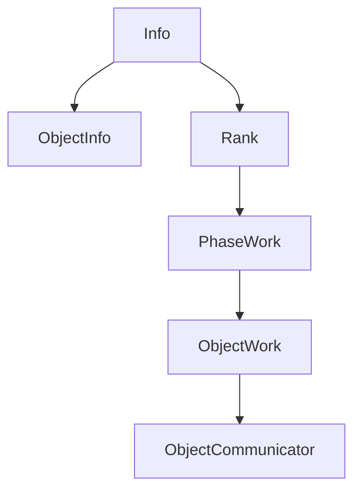

[](https://github.com/DARMA-tasking/vt-tv/actions/workflows/build-and-test-ubuntu.yml)
[](https://github.com/DARMA-tasking/vt-tv/actions/workflows/build-and-test-macos.yml)

# tv => task visualizer

`vt-tv` provides visualizations of the work-to-rank mappings, communications, and memory usage of an application.

Jump to:
- [Overview](#overview)
- [Getting Started](#getting-started)
- [Installation and Usage](#installation-and-usage)
- [Design Information](#design-information)

## Overview

Specifically, the task visualizer takes in JSON files that describe work as a series of phases and subphases
that contain 1) tasks for each rank, 2) communications, and 3) other user-defined fields (such as memory usage).

Using such input data, the task visualizer produces Exodus meshes to
describe the ranks and objects over time, which can be visualized
using Paraview. Additionally, the task visualizer can produce PNGs
directly using a VTK workflow to render a visualization of ranks and
tasks over phases (as seen below).


## Getting Started

You need the following dependencies:

1. A C++ compiler that supports C++17
2. [`cmake`](https://cmake.org/cmake/help/latest/) >= 3.17
3. [`VTK`](https://docs.vtk.org/en/latest/index.html) (build instructions [here](https://gitlab.kitware.com/vtk/vtk/-/blob/master/Documentation/docs/build_instructions/build.md))

Begin by cloning `vt-tv`:

```
git clone https://github.com/DARMA-tasking/vt-tv.git
```

_From now on, we will assume that the `vt-tv` source is located in `${VTTV_SOURCE_DIR}`._

## Installation and Usage

`vt-tv` can be installed as either a standalone C++ app or as a Python module. Instructions for both cases are included in the dropdowns below.

<details>
<summary><b>Standalone</b></summary>

### 1. Build

For the simplest build, run from `${VTTV_SOURCE_DIR}`:

```
VTK_DIR=/path/to/vtk/build ./build.sh
```

To build and run tests, add the `--tests-run` flag:

```
VTK_DIR=/path/to/vtk/build ./build.sh --tests-run
```

More documentation for `build.sh` can be found within the script itself, including examples.

Alternatively, for an interactive build process, run:

```
./interactive_build.sh
```

_From now on, we will assume  that the `vt-tv` build is in `${VTTV_BUILD_DIR}`._

---

### 2. Usage

`vt-tv` requires two inputs:

1. One or more JSON data files
2. A YAML configuration file (which contains the path to the JSON data files)

The basic call to `vt-tv` is:

```bash
${VTTV_BUILD_DIR}/apps/vt_standalone -c path/to/config
```

_**IMPORTANT:** The_ `path/to/config` _argument should be relative to_ `${VTTV_SOURCE_DIR}` _(see example below)._

#### YAML Input

A YAML configuration exemplar can be found in `${VTTV_SOURCE_DIR}/config/conf.yaml`. To use it, run

```bash
${VTTV_BUILD_DIR}/apps/vt_standalone -c config/conf.yaml
```

The following is a complete description of possible keys that can be used in a configuration file:

```yaml
input:
  # Directory containing the input data files
  directory: data/lb_test_data
  # (Optional) Stem of the data file names. Default is "data"
  data_file_stem: data
  # Number of ranks (data files) expected
  n_ranks: 4

viz:
  # Number of ranks along the X-axis
  x_ranks: 2
  # Number of ranks along the Y-axis
  y_ranks: 2
  # (Optional) Number of ranks along the Z-axis. Default is 1
  z_ranks: 1
  # (Optional) Adds jitter to the object positions. Default is 0.5
  object_jitter: 0.5
  # (Optional) Quantity of interest for ranks. Default is "load"
  rank_qoi: load
  # (Optional) Quantity of interest for objects. Default is "load"
  object_qoi: load
  # (Optional) Enable or disable saving of 3D meshes. Default is true
  save_meshes: true
  # (Optional) Enable or disable saving of PNG visualizations. Default is true
  save_pngs: true
  # (Optional) Force continuous quantities of interest for objects. Default is true
  force_continuous_object_qoi: true

output:
  # (Optional) Directory for saving output files. Default is "output"
  directory: output
  # (Optional) Base name for output files. Default is "vttv"
  file_stem: lb_test
  # (Optional) Visualization window size in pixels. Default is 2000
  window_size: 2000
  # (Optional) Font size for visualizations. Default is 2.5% of the window size
  font_size: 50
```

**Additional Notes:**

- Output Directory:
    The directory specified in `output.directory` must already exist. If it does not, `vt-tv` will fail during runtime.

- Validation:
    The number of files matching the pattern `input.data_file_stem.[integer].json` (with `[integer]` indicating the rank the file was generated for) in the `input.directory` must match the value of `input.n_ranks`.
    The product of `viz.x_ranks`, `viz.y_ranks`, and `viz.z_ranks` must equal `input.n_ranks`.

#### JSON Data Files

Sample JSON data files are provided in `${VTTV_SOURCE_DIR}/tests/unit/lb_test_data`.

Information regarding the JSON format can be found in vt's [documentation](https://darma-tasking.github.io/docs/html/node-lb-data.html); the JSON schema validator is located in the vt [repo](https://github.com/DARMA-tasking/vt/blob/develop/scripts/JSON_data_files_validator.py).

Additionally, DARMA-tasking's Load Balancing Analysis Framework (LBAF) provides a Python script ([lbsJSONDataFilesMaker.py](https://github.com/DARMA-tasking/LB-analysis-framework/blob/develop/src/lbaf/Utils/lbsJSONDataFilesMaker.py)) that may be used to generate JSON data files.


</details>
<details>
<summary><b>Python Module</b></summary>

### Dependencies

In addition to the basic `vt-tv` dependencies listed above, you also need:

1. A Python version between 3.8 - 3.11
2. [`nanobind`](https://nanobind.readthedocs.io/en/latest/), which can be installed with:

```sh
pip install nanobind
```

### 1. Install

First, specify the location of your `VTK` build (see above) with:

```bash
export VTK_DIR=/path/to/vtk/build
```

Optional: To specify the number of parallel jobs to use during the build, you can set the `VT_TV_CMAKE_JOBS` environment variable:

```bash
export VT_TV_CMAKE_JOBS=8
```

Then install the binded `vt-tv` Python module with:

```bash
pip install ${VTTV_SOURCE_DIR}
```

_Note: Behind the scenes, the usual `cmake` and `make` commands are run. Depending on your system, this can cause the install process to be lengthy as it will be compiling the entire `vt-tv` library._

---

### 2. Usage

Import the `vt-tv` module into your project using:

```python
import vttv
```

The only function you need is `vttv.tvFromJson`, which has the following (C++) function signature:

```cpp
void tvFromJson(
    const std::vector<std::string>& input_json_per_rank_list,
    const std::string& input_yaml_params_str,
    uint64_t num_ranks
)
```

The parameters are:
- `input_json_per_rank_list`: A list of the input JSON data strings (one string per rank). In the C++ standalone app, this equates to the input JSON data files.
- `input_yaml_params_str`: The visualization and output configuration data, formatted as a dictionary but exported as a string (see example below). This equates to the standalone app's input YAML configuration file.
- `num_ranks`: The number of ranks to be visualized by `vt-tv`.

As an example, here is the (emptied) code used by the [`Load Balancing Analysis Framework`](https://github.com/DARMA-tasking/LB-analysis-framework) to call `vt-tv`:

```python
import vttv

# Populate with the JSON data from each rank
ranks_json_str = []

# Populate with the desired configuration parameters
vttv_params = {
    "x_ranks": ,
    "y_ranks": ,
    "z_ranks": ,
    "object_jitter": ,
    "rank_qoi": ,
    "object_qoi": ,
    "save_meshes": ,
    "force_continuous_object_qoi": ,
    "output_visualization_dir": ,
    "output_visualization_file_stem":
}

# Populate with number of ranks used in the current problem
num_ranks =

# Call vt-tv
vttv.tvFromJson(ranks_json_str, str(vttv_params), num_ranks)
```
</details>

## Design Information

### 1. Quantities of Interest

`vt-tv` visualizes various Quantities of Interest (QOI) as requested by the user in the YAML configuration file:

```yaml
visualization:
    # Other parameters...
    rank_qoi:
    object_qoi:
```

While `vt-tv` natively supports a variety of QOI, such as the `load`, `id`, or `volume` of ranks and objects[^1], we also support user-defined QOI, called `attributes`.

<details>
<summary><b>Rank Attributes</b></summary>

<br />

Rank `attributes` are defined in the `metadata` field of the JSON data files. For example:

```json
{
    "metadata": {
        "rank": 0,
        "attributes": {
            "max_memory_usage": 8.0e+9
        }
    }
}
```
In this example, the user defines `max_memory_usage` as a rank attribute. This can then be specified as a `rank_qoi` in the YAML configuration file.

</details>
<details>
<summary><b>Object Attributes</b></summary>

<br />

Object `attributes` are defined in the `tasks` field of the JSON data files. For example:

```json
{
    "phases": [
        {
            "id": 0,
            "tasks": [
                {
                    "entity": {
                        "home": 0,
                        "id": 0,
                        "migratable": true,
                        "type": "object"
                    },
                    "node": 0,
                    "resource": "cpu",
                    "time": 2.0,
                    "attributes": {
                        "home_rank": 0,
                        "shared_bytes": 10000.0,
                        "shared_id": 0
                    }
                },
            ]
        }
    ]
}
```

In this case, the user has defined `home_rank`, `shared_bytes` and `shared_id` as potential QOI.

In the YAML configuration file passed to `vt-tv`, they may specify any of these as their `object_qoi`.

</details>

### 2. General Structure

`vt-tv` is designed according to the following hierarchy:



Further information on each class, including methods and member variables, can be found in the documentation.

#### 1. Navigating the Hierarchy

Users should interact mainly with the overarching `Info` class, which contains functions that drill down the hierarchy to get the desired information.

For example, an instance of `Info` holds getters to all object and rank QOI (including user_defined attributes):

```cpp
auto rank_qoi = info.getRankQOIAtPhase(rank_id, phase_id, qoi_string);
auto obj_qoi = info.getObjectQOIAtPhase(obj_id, phase_id, qoi_string);
```
where the `qoi_string` is the name of the desired QOI, like "load" or "id". This string can also be a user-defined attribute, as described above.

#### 2. ObjectInfo vs. ObjectWork

There are two classes that hold object data: `ObjectInfo` and `ObjectWork`.

`ObjectInfo` holds information about a given object across all ranks and phases. This includes:
- the ID
- the home rank (where the object originated)
- whether the object is migratable or sentinel (stays on the same rank)

`ObjectWork` holds information about an object that may vary as it changes rank or phase, such as:
- the attributes
- the communications

> [!TIP]
> As discussed above, users should utilize the getters present in `Info` rather than directly calling these classes.

[^1]: For a list of all natively-supported QOI for ranks and objects, see [`src/vt-tv/api/info.h`](https://github.com/DARMA-tasking/vt-tv/blob/master/src/vt-tv/api/info.h).